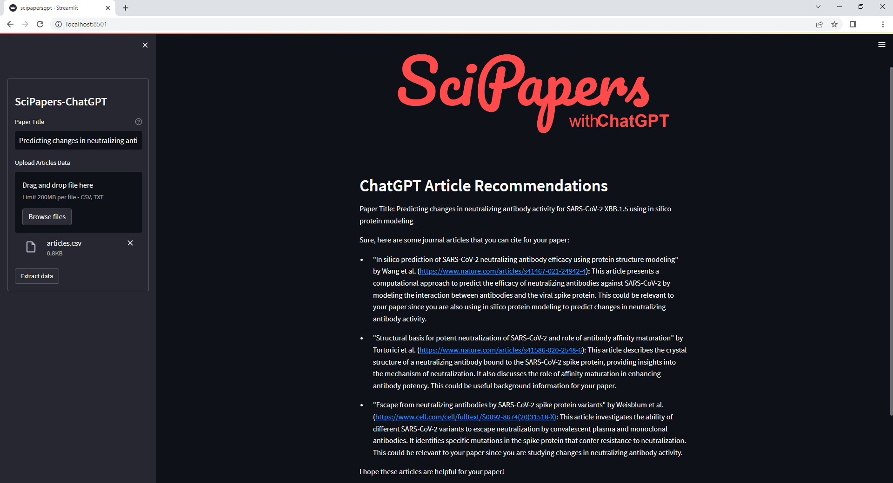

# SciPapers-ChatGPT

<h3 align="right">Colby T. Ford, Ph.D.</h3>

### Companion Repository for Medium Article: [Deploying Azure OpenAI and Building a Custom Science Article Recommender App with ChatGPT](https://colbyford.medium.com/deploying-azure-openai-and-building-a-custom-science-article-recommender-app-with-chatgpt-a19ccf1f9860)

In this sample project, we create a custom scientific paper recommendation system using a ChatGPT-like model deployed from Azure OpenAI. This is then wrapped in a basic Streamlit app for users to input their own journal articles and research title to have recommendatiosn generated for them.




## Credentials

Once you have created your own [Azure OpenAI service](https://portal.azure.com/#create/Microsoft.CognitiveServicesOpenAI) and deployed your GPT model, be sure to update the included `credentals.yaml` file.

```yaml
---
# Azure OpenAI - API Connection Information
## Referenced from: https://github.com/Azure/openai-samples/blob/main/ChatGPT/chatGPT_managing_conversation.ipynb
api_type : azure
## The base URL for your Azure OpenAI resource. e.g. "https://<your resource name>.openai.azure.com"
api_base: https://<resource>.openai.azure.com/
## The API key for your Azure OpenAI resource.
api_key: 12345abcdef
## Currently, the only option that is available is: 2022-12-01
api_version: '2022-12-01'
## The name of your deployed model
chatgpt_model_name: gpt-35_deployment_001
```

## To Run
Run the following command and the SciPapers Streamlit app will be shown at `http://localhost:8501`.
```bash
streamlit run .\scipapersgpt.py 
```

## Other Resources
- ChatGPT Samples: https://github.com/Azure/openai-samples/blob/main/ChatGPT/chatGPT_managing_conversation.ipynb
- Sam Edelstein’s GoodReads-ChatGPT GitHub Repo: GitHub — samedelstein/goodreads_chatgpt
- OpenAI Python Library Examples: https://github.com/Azure/openai-samples
- Azure OpenAI Studio: https://oai.azure.com/
- Streamlit Docs: https://docs.streamlit.io/
- Streamlit Getting Started: https://docs.streamlit.io/library/get-started
